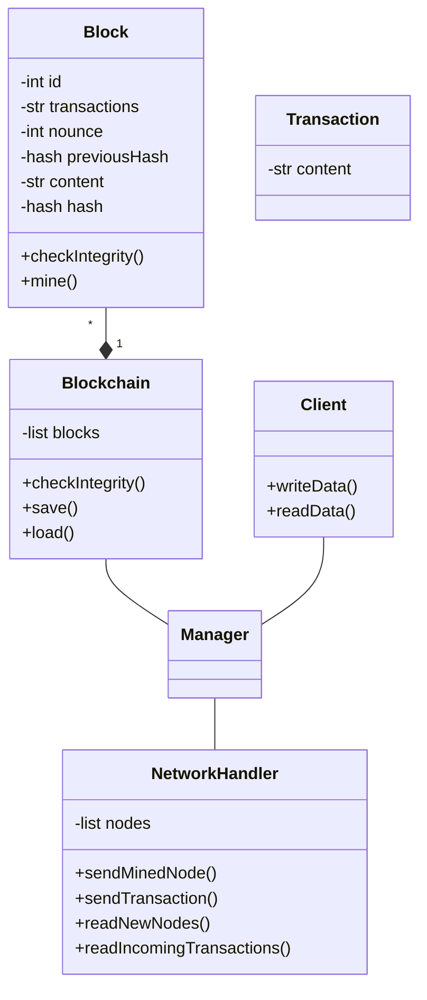

## Contraintes

- Le langage choisi est Python
- Les données doivent être facilement transmissibles sur le réseau

## Choix
- Algorithme de consensus: Preuve de travail
- On décide de miner un block à partir d'une certaine taille de données
- Les données sont stockées dans une base de donnée SQLite (au moins au début)

## Architecture

## Questions
- Avant d'être miné, les transactions contenues dans un bloc doivent être vérifiées. Mais ces transactions contiennent des données propres aux applications qui souhaitent interagir avec la blockchain, comment les nœuds (qui n'ont pas forcément ces applications) peuvent-ils effectuer cette validation ? Est-ce qu'il faut forcément une cryptomonnaie ?
- Classe Blockchain: Est-ce qu'il faut faire une liste des blocks ou juste un lien vers le dernier bloc et chaîner les blocs ensuite.